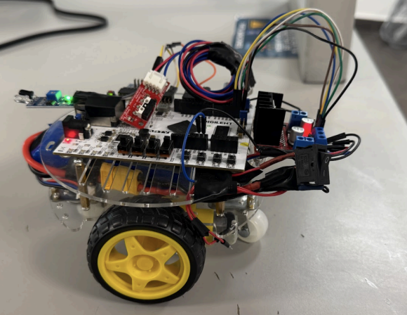
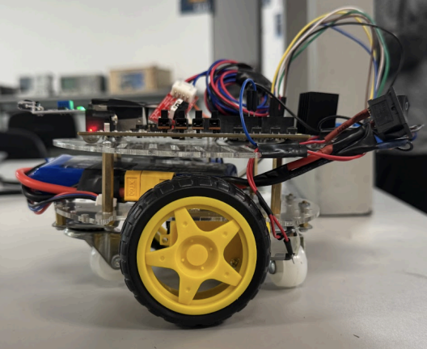

# Differential-Robot-Control-

Differential drive mobile robot using Vivado and VHDL for low-level control, using FPGA integrating assembly-level programming for efficient hardware interaction, and designing a user interface in App Inventor to enable intuitive robot navigation and obstacle avoidance.

Link to a demostrative Video: https://youtu.be/CFgagQNbed0?si=rC5L3r2qN9zabIYG

